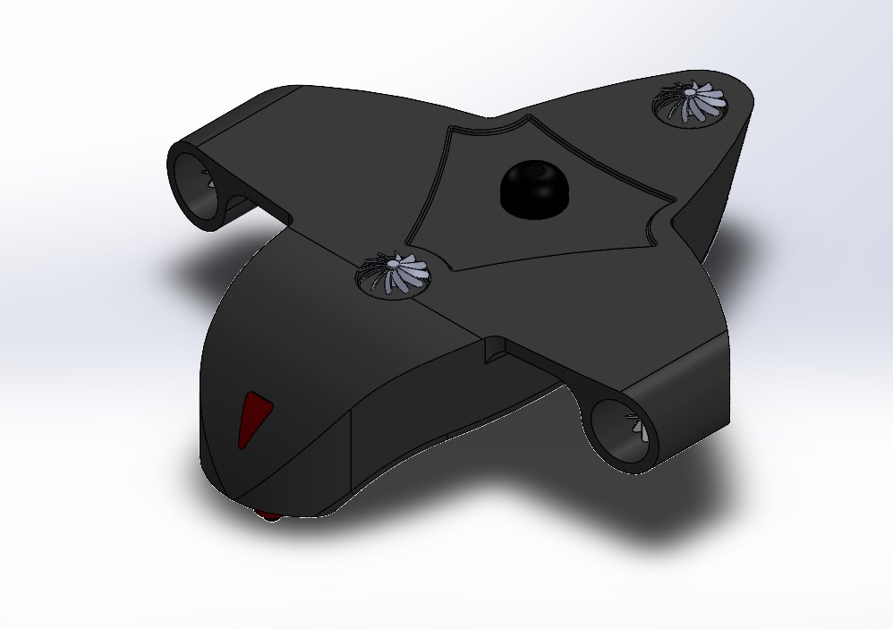

# AUV Pipeline Inspection Concept Design

This repository contains a student concept-design project for an autonomous underwater vehicle (AUV) intended for underwater pipeline inspection.

The work focuses on early system development: requirements definition, architecture modeling, basic verification models, and a CAD concept of the vehicle. The main tools used were Visual Paradigm, MATLAB System Composer / Simulink, and SolidWorks.

## CAD preview



## What is inside

- **Requirements** for mission, communication, localization, diagnosis, control, safety, and maintenance
- **Architecture models** created in Visual Paradigm and MATLAB System Composer / Simulink
- **Test-related models and test artifacts** for selected system functions
- **SolidWorks CAD files** for the AUV concept and its main parts
- **CAD screenshots** for quick viewing on GitHub

## Repository structure

```text
assets/
  cad_screenshots/              CAD renders for quick preview
  architecture_screenshots/     Put exported screenshots here for GitHub viewing

mbse/
  matlab_simulink/              System Composer, Simulink, requirements, and test files

visual_paradigm/
  AUV.vpp                       Visual Paradigm project

cad/
  solidworks/                   SolidWorks assembly and part files
```

## Main files

### MATLAB / Simulink / System Composer
- `mbse/matlab_simulink/AUVreq.slreqx`
- `mbse/matlab_simulink/DiagnosPipeline.slx`
- `mbse/matlab_simulink/DiagnosPipelineLogical.slx`
- `mbse/matlab_simulink/Controller.slx`
- `mbse/matlab_simulink/IntegratedLocalizationProcessor.slx`
- `mbse/matlab_simulink/DiagnosisProcessor.slx`
- `mbse/matlab_simulink/NavigationProcessor.slx`
- `mbse/matlab_simulink/SysForTest.slx`

### Visual Paradigm
- `visual_paradigm/AUV.vpp`

### SolidWorks
- `cad/solidworks/Assem1.SLDASM`

## Suggested architecture screenshots for this README

To make the repository easier to browse on GitHub, export screenshots from your diagrams and place them in:

`assets/architecture_screenshots/`

Suggested filenames:
- `requirements_diagram.png`
- `logical_architecture.png`
- `physical_architecture.png`
- `test_architecture.png`
- `activity_or_sequence_view.png`

After you add them, you can place them in this README with markdown like this:

```md
## Architecture snapshots


```

## Notes

This is a concept and system-design project, so the repository is centered on requirements, architecture, verification models, and CAD rather than implementation-level embedded software.

Generated cache folders, backup files, and temporary MATLAB artifacts were removed to keep the repository cleaner.
